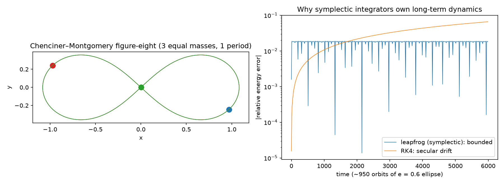

# nbodylab

**Symplectic N-body dynamics with analytic and literature anchors: Kepler
invariants, the leapfrog-vs-RK4 energy story, and the Chenciner–Montgomery
figure-eight choreography.**



The point of this package is the *test suite* — each test pins the
integrators to something known independently:

- **Kepler invariants**: energy to 1e-7, angular momentum to 1e-9, perihelion
  return after exactly one period, aphelion at `a(1+e)`.
- **The symplectic signature, asserted quantitatively.** A linear secular
  drift makes the max energy error over the last quarter of a run ≈ 4× the
  first quarter's; a bounded oscillation makes that ratio ≈ 1. Over ~950
  orbits of an e = 0.6 ellipse the suite requires leapfrog's ratio < 2,
  RK4's > 3, *and* RK4 to end up worse than leapfrog despite being
  fourth-order — the reason astronomers integrate the solar system with
  low-order symplectic schemes rather than high-order Runge-Kutta.
- **Time reversibility**: a leapfrog step forward then backward restores the
  state to 1e-14.
- **The figure-eight** (Chenciner & Montgomery 2000): three equal masses on
  the published initial conditions must close their orbit after
  T = 6.32591398 *and* satisfy the choreography property — one third of a
  period later each body occupies the next body's position.
- Momentum-frame preservation to machine precision for random 5-body systems.

## Install & use

```bash
pip install -e ".[dev]"
```

```python
from nbodylab import figure_eight, integrate, FIGURE_EIGHT_PERIOD

system = figure_eight()
history = integrate(system, FIGURE_EIGHT_PERIOD / 20000, 20000, record_every=10)
print(system.energy(), history["positions"].shape)
```

Regenerate the figure: `python examples/showcase.py`.

## Tests

```bash
pytest -q     # 9 tests
ruff check .
```

## License

MIT
